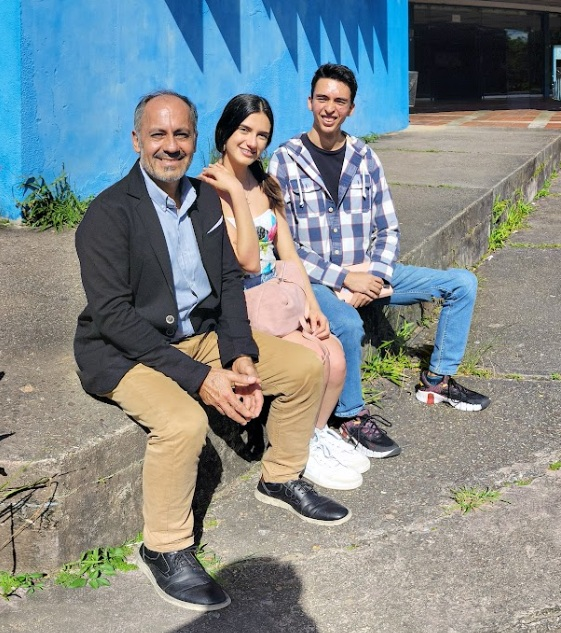

# 🔍 Face Detector | OpenCV Annotation Tool

**Automatically detect human faces in images using Haar Cascades and annotate them with bounding boxes**

[](https://opencv.org/)
[](https://python.org)
[](LICENSE)

## 🖼️ Example

| Original Image | Detected Faces |
|----------------|----------------|
|  |  |

---

## ✨ Features
- 🧠 Face detection using Haar Cascade Classifier
- 📦 Simple, clean annotations
- 🗂️ Processes local images from folder
- 💾 Output stored with bounding boxes

---

## 🛠️ Installation
```bash
git clone https://github.com/your-username/face-detector.git
cd face-detector
pip install -r requirements.txt
```

## 🚀 Quick Start
1. Add images to data/input/
2. Run detection:
```bash
python src/main.py
```
3. Find annotated images in data/output/
