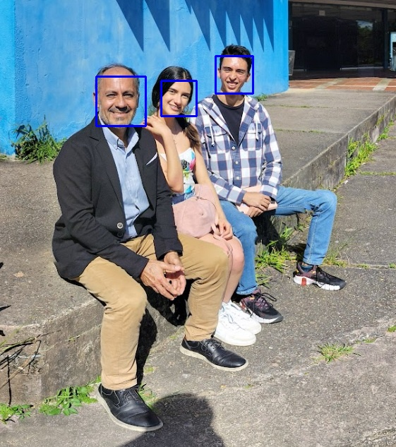

# 🔍 Vision Detector | OpenCV Annotation Tool

**Automatically detect faces and objects in images with labeled bounding boxes**

[](https://opencv.org/)
[](https://python.org)
[](LICENSE)

  
*Example output with detected faces (green) and objects (blue)*

## ✨ Features
- **Face Detection** using Haar Cascades
- **80+ Object Detection** (COCO dataset)
- Confidence scores for each detection
- Clean visual annotations
- Batch image processing support

## 🛠️ Installation
```bash
git clone https://github.com/your-username/vision-detector.git
cd vision-detector
pip install -r requirements.txt
```

## 🚀 Quick Start
1. Add images to data/input/
2. Run detection:
```bash
python src/main.py
```
3. Find annotated images in data/output/
### Advanced Options:
```bash
# Custom input/output paths
python src/main.py --input data/input/custom.jpg --output results/final.jpg

# Adjust confidence threshold (default: 0.5)
python src/main.py --confidence 0.7
```

## 🛠️ Customization
To detect specific objects only:
Edit coco.names and keep only classes you need (e.g., "person", "car", "dog").
